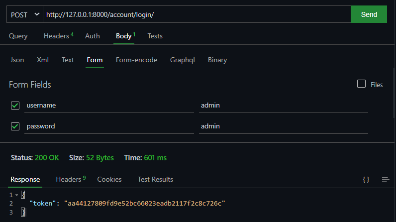
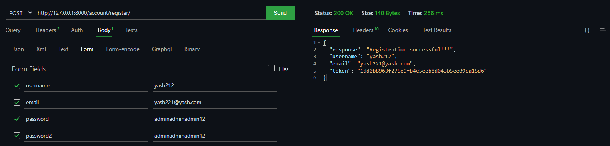
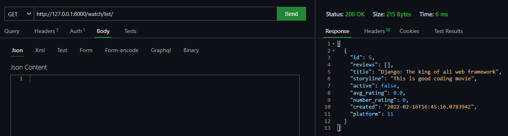
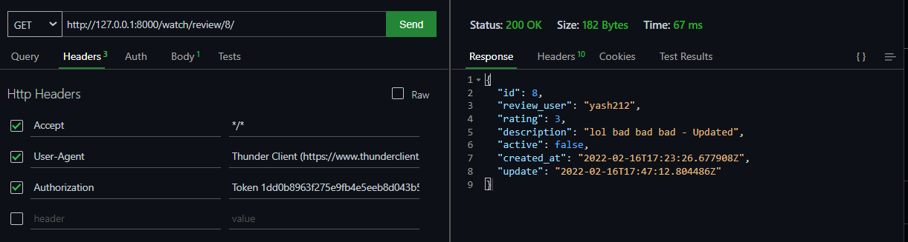
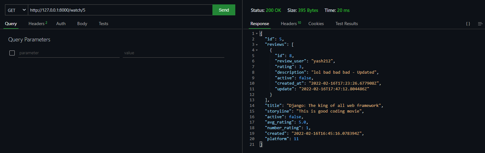
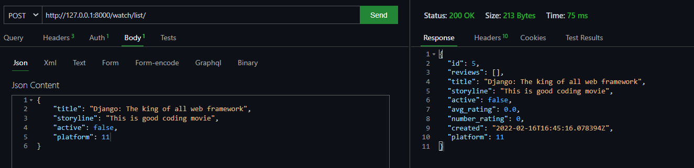

# ***Watch Mate***

I ma creating this project and learning the `django rest framework`

## Steps to run this project

- Clone the project
- Create a virtual environment using `python3 -m venv env`
- Actiivate the virtual environment using `source env/bin/activate`
- Install the requirements using `pip install -r requirements.txt`
- Run the command `python manage.py makemigrations` to create the migrations
- Then run the command `python manage.py migrate` to apply the migrations
- Now are ready to run the server using `python manage.py runserver`

<h1 style="color: yellow">
Login, Logout and Register
</h1>

> <h2 style="color:brown">
> Login (All Users)
> </h2>
>
> Request: `POST`
>
> **Use this endpoint in any client software like `postman` or `Thunder client(in vscode)` to generate a `Token`**
>
> Path: `http://127.0.0.1:8000/account/login/`
>
> 

> <h2 style="color:brown">
> Register (All Users)
> </h2>
>
> Request: `POST`
>
> **Use this endpoint in any client software like `postman` or `Thunder client(in vscode)` to generate a `Token`**
>
> When you register your account at that time your `token` will be generated automatically and you will be not be registred as admin if you login from this endpoint so if you want to be admin user then you need to run command as `python manage.py createsuperuser` and then login from the `login` endpoint then you will get token related to admin user and you can access all endpoints which are made for normal users and admin users.
>
> Path: `http://127.0.0.1:8000/account/register/`
>
> 

> <h2 style="color:brown">
> Logout (All Users)
> </h2>
>
> Request: `POST`
>
> **Use this endpoint in any client software like `postman` or `Thunder client(in vscode)` to generate a `Token`**
>
> When you logout the user your token will be deleted and you will not be able to access any endpoints which are made for normal users and admin users. To access them again you need to login
>
> Path: `http://127.0.0.1:8000/account/logout/`
>
> 

<h1 style="color: green">
Normal User Related Endpoints
</h1>

> <h2 style="color:skyblue">
> Movie List (For All users is you send GET request)
> </h2>
>
> Request: `POST(if admin user)` & `GET(if normal user or not logged in)`
>
> **Use this endpoint in any client software like `postman` or `Thunder client(in vscode)` to generate a `Token`**
>
> In this endpoint you can see all the list even if you are not admin or not logged in.
>
> Path: `http://127.0.0.1:8000/watch/list/`
>
> 

> <h2 style="color:skyblue">
> Create Review (User who are logged in)
> </h2>
>
> Request: `POST(if you are normal user or admin)`
>
> **Use this endpoint in any client software like `postman` or `Thunder client(in vscode)` to generate a `Token`**
>
> Now here `<int:pk>` this means that you need to write the movie id which you want to review.
>
> Path: `http://127.0.0.1:8000/watch/<int:pk>/review-create/`
>
> 

> <h2 style="color:skyblue">
> Review List (User who are logged in)
> </h2>
>
> Request: `GET(If User is logged in)`
>
> **Use this endpoint in any client software like `postman` or `Thunder client(in vscode)` to generate a `Token`**
>
> Now here `<int:pk>` this means that you need to write the movie id which you want to see all the reviews related to that movie only.
>
> Path: `http://127.0.0.1:8000/watch/<int:pk>/reviews/`
>
> 

> <h2 style="color:skyblue">
> Review Detail (User who are logged in)
> </h2>
>
> Request: `GET`, `PUT`, `DELETE`
>
> **Use this endpoint in any client software like `postman` or `Thunder client(in vscode)` to generate a `Token`**
>
> Now here `<int:pk>` this means that you need to write the review id which you want to see or `update` or `delete` that review.
>
> Path: `http://127.0.0.1:8000/watch/review/<int:pk>/`
>
> 

> <h2 style="color:skyblue">
> Movie Detail (Admin can delete and update)
> </h2>
>
> Request: `GET`, `PUT`, `DELETE`
>
> **Use this endpoint in any client software like `postman` or `Thunder client(in vscode)` to generate a `Token`**
>
> Now here `<int:pk>` this means that you need to write the movie id which you want to see or `update` or `delete` that review.
>
> Path: `http://127.0.0.1:8000/watch/<int:pk>`
>
> 

<h1 style="color: Red">

Admin Related Endpoints
</h1>

> <h2 style="color:purple">
> Create Stream Platform (For Admin users)
> </h2>
>
> Request: `POST(if admin user)` & `GET(if normal user)`
>
> **Use this endpoint in any client software like `postman` or `Thunder client(in vscode)` to generate a `Token`**
>
> Use the token that was created when you logged in and you must be `ADMIN` to create a Stream platform
>
> Path: `http://127.0.0.1:8000/watch/stream/`
>
> 

> <h2 style="color:purple">
> Create Movie (For Admin users)
> </h2>
>
> Request: `POST(if admin user)` & `GET(if normal user)`
>
> **Use this endpoint in any client software like `postman` or `Thunder client(in vscode)` to generate a `Token`**
>
> Use the token that was created when you logged in and you must be `ADMIN` to create a Stream platform
>
> Path: `http://127.0.0.1:8000/watch/list/`
>
> 
